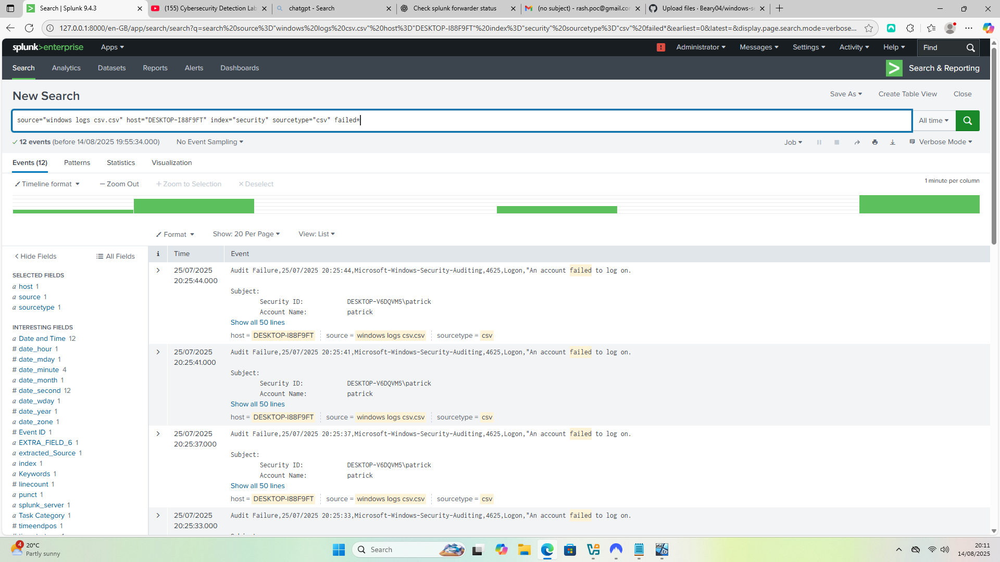
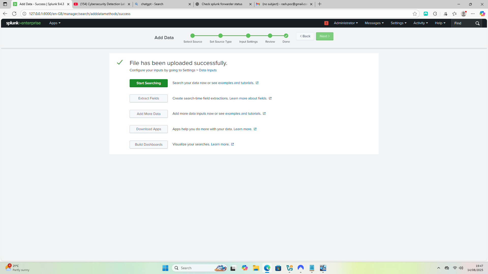
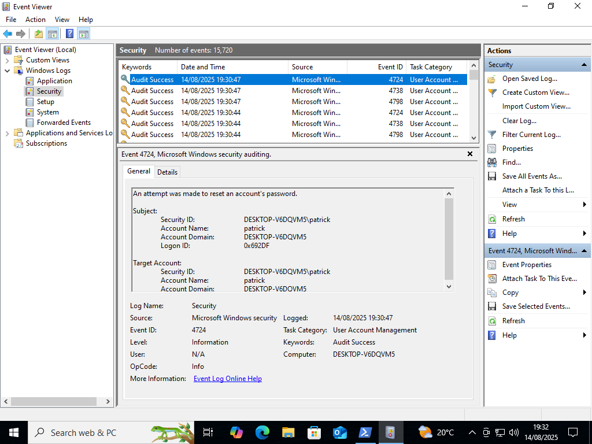
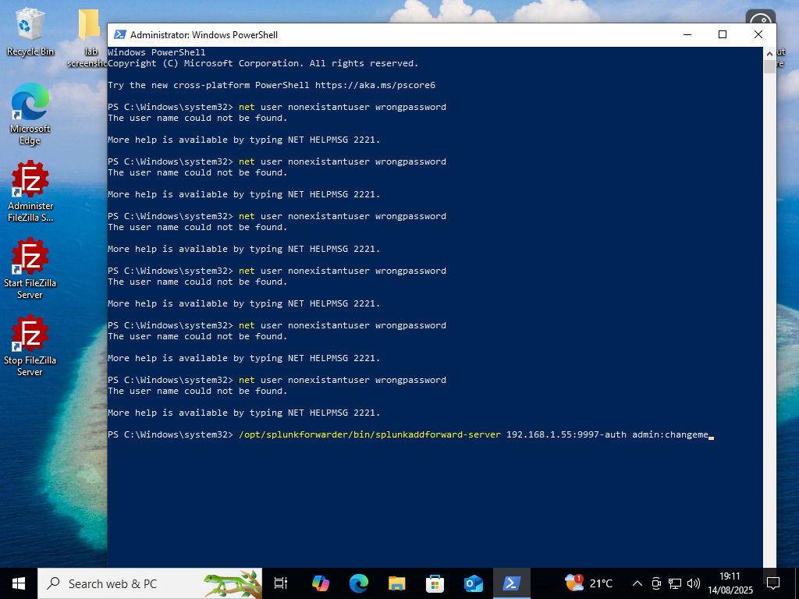

# windows-security-log-brute-force-attempt
A hands-on Splunk lab demonstrating the ingestion and analysis of Windows Security logs. The lab showcases event types such as password resets (4724), account changes (4738), and failed logons (4625), highlighting practical skills in log management, event auditing, and Splunk search queries.

### Splunk enterprise logs

### Event 4738 - Account Change

### Event 4624 - Successful Logon

### Powershell failed logons

